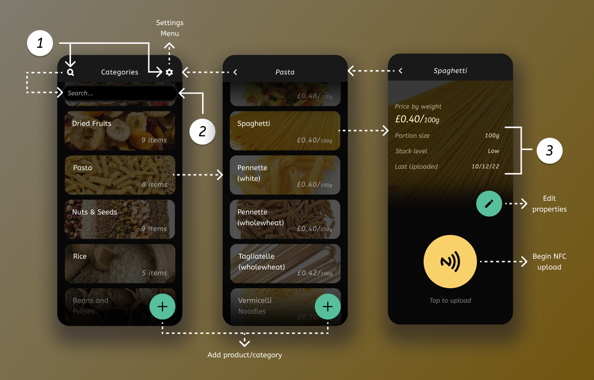

# Refill App

An Android app that allows shop staff to update product information for refill dispensers. Written in [Kotlin](https://kotlinlang.org/) using Android's [Jetpack Compose](https://developer.android.com/jetpack/compose) UI toolkit.

To run the app, clone the repository and open the project using [Android Studio](https://developer.android.com/studio). Then, build the app and run it on a connected Android device or the emulator within Android Studio.

## Design

